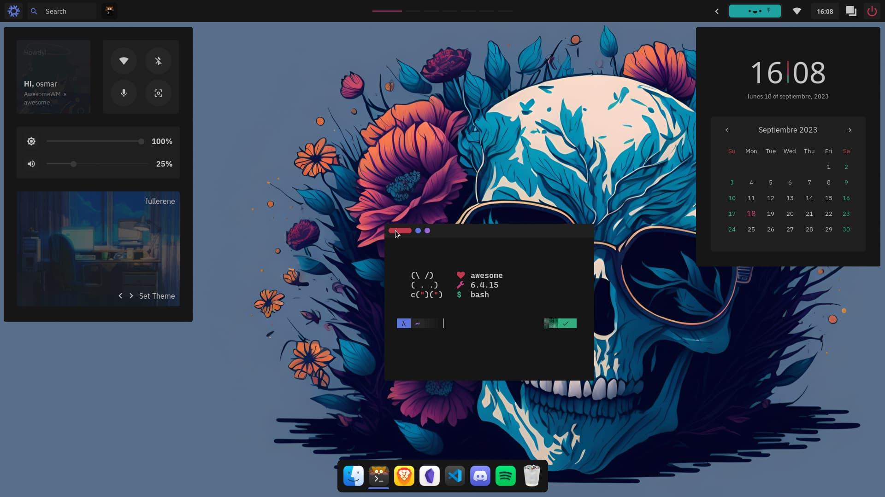
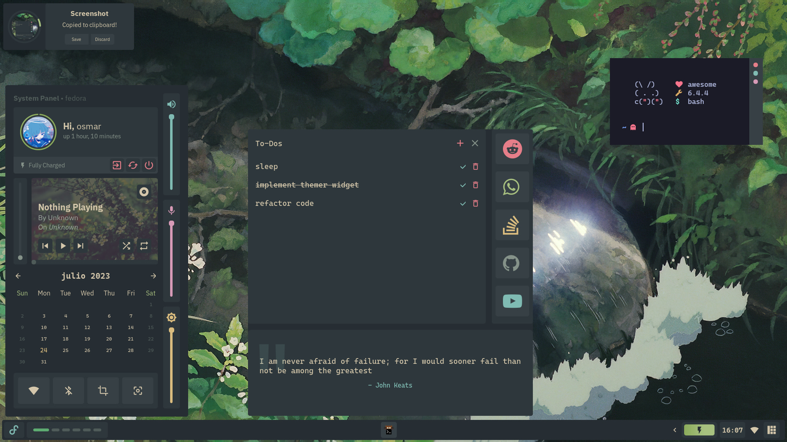
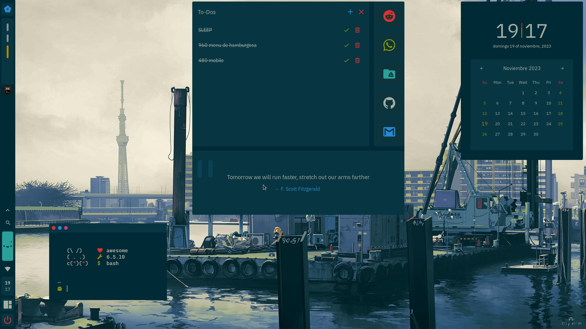
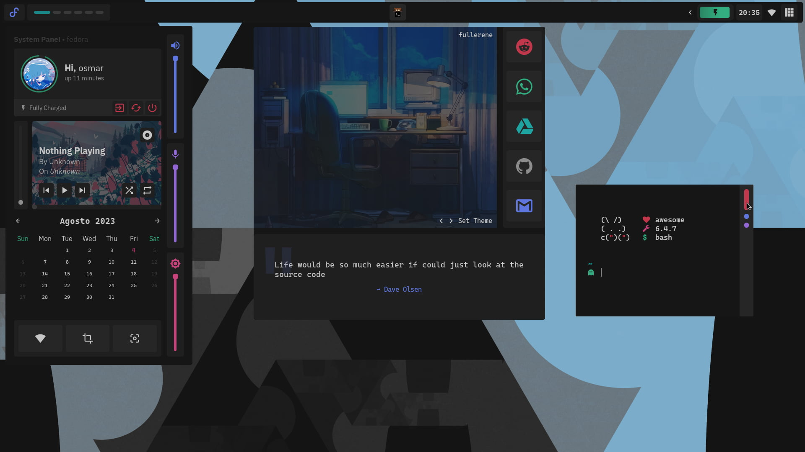

<!-- CREDITS FOR AWESOME PEOPLE -->

> **Important**
>  My configuration files have been created based on the [gwileful](https://github.com/Gwynsav/gwileful/) and [crystal](https://github.com/chadcat7/crystal) projects. So I ask people to give credit to these amazing people.

<!-- PROFILE PICTURE -->
<p align="center">
  
</p>

<!-- NAME PROYECT -->
<p align="center">
  <b>~ osmarmora05's configuration files ~</b>
</p>

<!-- BUTTONS -->
<p align="center">
<a href="#setup"></a>
<a href="#configuration"></a>
<a href="#usage"></a>
<a href="#modules"></a>
</p>

<!-- SHOWCASE -->
## 
<div align="center">




</div>

<!-- WARNING BROKEN CODE -->
> **Warning**
It is not uncommon for me to commit broken code. Also I don't guarantee this setup to be stable
or the slightest bit safe for use. You have been warned.

<!-- INFORMATION -->
## Hello! Thanks for coming! ❤️ 
These are my configuration files for **AwesomeWM** which includes a control center, panel with shortcuts to popular pages with a task list, notifications, screenshot tools, interactive calendar, cute battery face, minimalist Exitscreen, multiple color schemes and much more...

<!-- INFORMATION -->
## Features of config
- **WM:** [AwesomeWM](https://github.com/awesomeWM/awesome) 
- **Operating system:** [Fedora](https://fedoraproject.org/workstation/download/)
- **Terminal:** [Kitty](https://github.com/kovidgoyal/kitty)
- **Shell:** zsh
- **Prompt:** [powerlevel10k](https://github.com/romkatv/powerlevel10k)
- **File Manager CLI:** [Ranger](https://github.com/ranger/ranger) 
- **File Manager UI:** nautilus

<!-- SETUP -->
## Setup

<details>
<summary><b>1. Install Required Dependencies</b></summary>

1. First of all you should install the Awesome-git.


    **Arch users** can use the [Awesome-git AUR package](https://aur.archlinux.org/packages/awesome-git/).
    ```shell
    yay -S awesome-git
    ```

    In the case of **Fedora-based distributions**, it is necessary to install certain libraries before proceeding with the Awesome-git installation.
    ```shell
    sudo dnf install xcb-util-devel xcb-util-keysyms-devel xcb-util-wm-devel 
    startup-notification-devel libxdg-basedir-devel xcb-util-xrm-devel libxkbcommon-x11-devel xcb-cursor-devel 
    make automake gcc gcc-c++ cmake glib2-devel gdk-pixbuf2-devel cairo-devel libX11-devel xcb-util-cursor-devel 
    xcb-util-devel xcb-util-keysyms-devel xcb-util-wm-devel libxkbcommon-devel cairo-devel xcb-util-image-devel 
    libstartup-notification-devel libxdg-basedir-devel xcb-util-xrm-devel libxcb-devel lua-devel cmake 
    startup-notification-devel libxkbcommon-devel libxkbcommon-x11-devel libxdg-basedir-devel xcb-util-xrm-devel
    ```

    Once we have completed the prerequisites, we proceed to follow the Awesome-git build instructions found [here](https://github.com/awesomeWM/awesome/#building-and-installation).

2. Installation of dependencies
   
    **Mandatory**
    - [Awesome-git](https://github.com/awesomeWM/awesome) (If you have reached this point you should already have it installed (๑ᵔ⤙ᵔ๑))
    - [Network Manager](https://github.com/NetworkManager/NetworkManager) (network signals)
    - [Pipewire](https://github.com/PipeWire/pipewire) and
    [Wireplumber](https://github.com/PipeWire/wireplumber) (audio signals)
    - [maim](https://github.com/naelstrof/maim),
    [slop](https://github.com/naelstrof/slop),
    [xclip](https://github.com/astrand/xclip) (screenshots)
    - [Papirus](https://github.com/PapirusDevelopmentTeam/papirus-icon-theme), [WhiteSur-icon-theme](https://github.com/vinceliuice/WhiteSur-icon-theme)  (icon pack)
    - [IBM Plex Sans](https://github.com/IBM/plex/tree/master/IBM-Plex-Sans/fonts/complete/ttf),
    [Material Icons](https://github.com/google/material-design-icons) and [CaskaydiaCove Nerd Font](https://www.nerdfonts.com/font-downloads) or (you can find the required fonts inside the `misc/fonts` folder of this repository)
    - [brightnessctl](https://github.com/Hummer12007/brightnessctl) (brightness signals)
    - [bluez](https://github.com/bluez/bluez) (bluetooth signals)
    - [upower](https://github.com/freedesktop/upower) (battery signals)
    <p align="center">
      <b> </b>
    </p>

    > **Important**
    > The following commands do not include the dependency: [WhiteSur-icon-theme](https://github.com/vinceliuice/WhiteSur-icon-theme)


    <details>
    <summary><b> In fedora (Fedora-based distributions)</b></summary>

    ```shell
    sudo dnf install NetworkManager pipewire wireplumber maim slop xclip brightnessctl bluez upower papirus-icon-theme
    ```

    </details>

    <details>
    <summary><b> In Arch</b></summary>

    ```shell
    sudo yay -s NetworkManager pipewire wireplumber main slop xclip brightnessctl bluez upower papirus-icon-theme
    ```

    </details>

</details>


<details>

<!-- INSTALL MI CONFIGURATIONS -->
<summary><b>2. Install my configuration files</b></summary>


1. Clone this repository

    ```shell
    git clone https://github.com/osmarmora05/dotfiles.git
      ```

2. Install my AwesomeWM configuration files

    If you want just my AwesomeWM configuration

    ```shell
    cd dotfiles
    cp -r config/awesome/* ~/.config/
    ```
    
    Or if you want all the configuration

    ```shell
    cd dotfiles
    cp -r config/* ~/.config/
    ```
    **Optional** - Now if you want to get the source from the repository

    ```shell
    cd dotfiles
    cp -r misc/fonts/* /usr/share/fonts/
    ```

    Congratulations, at this point you have installed my configurations! 🎉

    Log out from your current desktop session and log in into AwesomeWM
    
</details>

> **Note**
If you find any spelling or installation errors, let me know.

<!-- CONFIGURATION -->
## Configuration

Simple Configuration

<details>

<p align="center">
    <b> </b>
</p>

Most of this project follows the structure of the [Suconakh](https://github.com/suconakh/awesome-awesome-rc) project. However, there are some additions by [gwynsav](https://github.com/Gwynsav/gwileful).

~ `config/user.lua` aggregates user options like the wallpaper, avatar, and other options like gaps, colorscheme, screenshot.

| Variable       | Type      | Description                                                                        |
| -------------- | --------- | ---------------------------------------------------------------------------------- |
| gaps           | `integer` | Spacing between clients and screen padding size                                    |
| colorscheme    | `string`  | `everblush`, `everforest`, `tokyonight`, `fullerene`, `oxocarbon` ,`catppuccin`,`mar`,`nord`,`gruvbox_dark`,`dracula`,`default`, `gruvbox_dark`, `adwaita`, `janleigh`, `gruvbox_light`, `solarized`,`plata`, and more to come  |
| avatar         | `string`  | Path to user profile picture                                                       |
| wallpaper      | `string`  | Path to user wallpaper                                                             |
| screenshot_dir | `string`  | Directory to save screenshots to                                                   |

<p align="center">
  <b> </b>
</p>

> **Warning**
It is not recommended to move the `colorscheme` variable in the `config/user.lua` file from line **21**. Because it is linked to the `themer` widgets, since its functionality is to edit this line depending on the theme set. If you move it from the current line, you must modify the second argument of the `setTheme` function call in the `widgets/control_center/module/themer.lua` file.

```lua
set_theme(' colourscheme = "' .. currTheme:gsub('"', '\\"') .. '",',line number,gfs.get_configuration_dir() .."config/username.lua") --Change theme
```

~ `config/auto.lua` contains autostart commands to be executed:

- At the start of an X session.
- Every time Awesome is loaded (and reloaded).
- Shell code.


<details>
<summary><b> Optional - Modification of the UI/widgets</b></summary>

<p align="center">
  <b> </b>
</p>

> **Warning**
If you are a user not familiar with programming, and mainly in lua, I recommend that you skip this part.


- todo-panel: 


~ `Shortcuts`  To modify the shortcuts, go to the following file `widgets/todo-panel/module/quiklinks.lua`. In this file you will find this code snippet that you can edit to customize the shortcuts

```lua
create_button('󰑍', 'https://www.reddit.com/', beautiful.red),
create_button('󰖣', 'https://web.whatsapp.com/', beautiful.green),
create_button('󰉎', 'https://drive.google.com/drive/', beautiful.cyan),
create_button('󰊤', 'https://github.com/osmarmora05', beautiful.fg_normal),
create_button('󰊫', 'https://mail.google.com/', beautiful.blue),
```

The `create_button` function call receives 3 elements as arguments:
1. The shortcuts icon, which you can get [here](https://www.nerdfonts.com/cheat-sheet)
2. The URL that the shortcut should point to.
3. The color of the icon

**It is recommended that you do not add or delete the number of shortcuts, so that the widget does not become deformed**


~ `Messages` To edit the messages, go to the following file `widgets/todo-panel/module/quote.lua` . In this file, you will find the next code snippet that you can edit to customize the messages

```lua
local quotes = {
  {
    quote = 'He that can have patience can have what he will',
    author = 'Benjamin Franklin'
  },
  {
    quote = 'I am never afraid of failure; for I would sooner fail than not be among the greatest',
    author = 'John Keats'
  },
  {
    quote = 'Tomorrow we will run faster, stretch out our arms farther',
    author = ' F. Scott Fitzgerald '
  },
  {
    quote = 'All we have to decide is what to do with the time that is given us. ',
    author = 'J. R. R. Tolkein'
  }
}

```

In the `quote` field you can write the message you want. It is recommended that the message **not exceed 85 characters** to ensure it displays correctly on the panel. In the countryside `author`, you can write the author of the message. It is recommended that the author be **no more than 15 characters**.

---

- wibar: 

~ `Distro icon` To change the wibar icon for your preferred distribution or an image that you like, you will have to perform the following steps:

1. Add the image to the following directory (image must be svg) `theme/assets/` . In this [link](https://github.com/osmarmora05/dotfiles/tree/master/config/awesome/themes/assets/distro) you will find some images of the most famous distributions and with the perfect format for the widget.
2. You will have to edit the following line of code:

```lua
_T.distro_logo = gc.recolor_image(asset_path .. 'nix_logo.svg', _T.blue)
```

In the part that says `nix_logo.svg` you will have to add the name you gave to the image


---

- Control Center:

~ `Description for avatar` To change the description of the avatar you will have to edit the following code in the file `widgets/controlCenter/module/profile.lua`

```lua
-- description/host
local desc = wibox.widget{
    widget = wibox.widget.textbox,
    markup = helpers.colorize_text('AwesomeWM is awesome', beautiful.fg_dark .. '99'),
    font = beautiful.font_sans .. '10',
    align = 'left',
    valign = 'center'
}
```

In the part that says `AwesomeWM is awesome`, add the description that you like, make it brief


---

- Dock:

~ `Add programs to the dock` To add or delete a program, go to the following file `widgets/dock/init.lua` and edit the following code fragment:

```lua
-- making some pinned apps
    local metadata = {
      {
        name = "nautilus",
        id = 1,
        count = 0,
        clients = {},
        class = "nautilus"
      },
      {
        count = 0,
        id = 2,
        clients = {},
        name = "kitty",
        class = "kitty"
      },
      {
        count = 0,
        id = 3,
        clients = {},
        name = "brave-browser",
        class = "brave-browser"
      },
      {
        count = 0,
        id = 4,
        name = "obsidian",
        clients = {},
        class = "obsidian"
      },
      {
        count = 0,
        id = 5,
        name = "code",
        clients = {},
        class = "code"
      },
      {
        count = 0,
        id = 6,
        name = "discord",
        clients = {},
        class = "discord"
      },
      {
        count = 0,
        id = 7,
        name = "spotify",
        clients = {},
        class = "spotify"
      },
    }
    
    local classes = { "kitty", "discord", "obsidian", "brave-browser", "spotify", "nautilus", "code" }
```
The elements of the `metadata` table are composed of:

1. `count`: Indicates the number of clients.

2. `id`: This is a unique identifier for each pinned program. In addition, it serves the purpose of avoiding duplicates, ensuring that the same pinned program does not appear multiple times.

3. `name` and `class`: These fields represent the command to be executed with its respective icon. The information for each of these fields is located in the following location: `/usr/share/icons/WhiteSur/apps/scalable/`.

The class classes contains the combination of command and icon. Any addition or removal of pinned programs must also be done in this arrangement.


> **Note**
This small section can be taken as a personalization guide for my configuration. Don't think that this is the only thing they can do with my configuration, they can totally modify it, steal widgets, basically they want them.

</details>
  
</details>


<!-- KEYBINDS -->
## Usage
<details>
<summary><b>Keybinds</b></summary>

| Keybind                | Description                                                |
| ---------------------- | ---------------------------------------------------------- |
| AwesomeWM              | -                                                          |
| `mod + Control + r`    | Reload AwesomeWM.                                          |
| `mod + s`              | Show help.                                                 |
| `mod + w`              | Show main menu.                                            |
| Applications           | -                                                          |
| `mod + Return`         | Opens a terminal.                                          |
| `mod + Shift + e`      | Opens a GUI file manager.                                  |
| Window Management      | -                                                          |
| `mod + q`              | Close focused client.                                      |
| `mod + Mouse1`         | Move client by dragging mouse.                             |
| `mod + Mouse3`         | Resize client by dragging mouse.                           |
| `Control + mod + Return`  | Move to master.                                         |
| `Control + mod + m`    | (un)maximize vertically.                                   |
| `Control + mod + n`    | Restore minimized.                                         |
| `Control + mod + Space` | toggle floating.                                          |
| `Shift + mod + j`      | Swap with next client by index.                            |
| `Shift + mod + k`      | Swap with previous client by index.                        |
| `Shift + mod + m`      | (un)maximize horizontally.                                 |
| `mod + f`              | Toggle fullscreen.                                         |
| `mod + j`              | Focus next by index.                                       |
| `mod + k`              | Focus previous by index.                                   |
| `mod + m`              | (un)maximize.                                              |
| `mod + n`              | Minimze.                                                   |
| `mod + o`              | Move to screen.                                            |
| `mod + t`              | Toggle keep on top.                                        |
| `mod + Tab`            | Go back.                                                   |
| `mod + u`              | Jump to urgent client.                                     |
| Layout Management      | -                                                          |
| `Alt + mod + j`        | Decrease client with factor.                               |
| `Alt + mod + k`        | Increase client with factor.                               |
| `Control + mod + h`    | Increase the number of columns.                            |
| `Control + mod + l`    | Decrease the number of columns.                            |
| `Shift + mod + h`      | Increase the number of master clients.                     |
| `Shift + mod + l`      | Decrease the number of master clients.                     |
| `Shift + mod + Space`  | Select previous.                                           |
| `mod + h`              | Decrease master with factor.                               |
| `mod + l`              | Increase master with factor.                               |
| `mod + space`          | Select next.                                               |
| Media Management       | -                                                          |
| `XF86AudioRaiseVolume` | Increase system audio volume.                              |
| `XF86AudioLowerVolume` | Decrease system audio volume.                              |
| `XF86MonBrightnessUp`  | Increase screen backlight brightness.                      |
| `XF86MonBrightnessDown`| Decrease screen backlight brightness.                      |
| `Print`                | Take cursor selection screenshot.                          |
| `mod + Print`          | Take fullscreen screenshot.                                |
| Tag                    | -                                                          |
| `Control + Shift + mod + 1/2/3/4/5/6/7/8/9/0` | Toggle focused client on tag.       |
| `Control + mod + 1/2/3/4/5/6/7/8/9/0` | Toggle tag.                                 |
| `Shift + mod + 1/2/3/4/5/6/7/8/9/0` | Move focused client to tag.                   |
| `mod + Left`           | View previous.                                             |
| `mod + Right`          | View next.                                                 |
| `mod + 1/2/3/4/5/6/7/8/9/0` | Only view tag.                                        |
| `mod + Esc`            | Go back.                                                   |
| UI                     | -                                                          |
| `mod + c`              | Toggle control center visibility.                          |
| `mod + t`              | Toggle themer-panel visibility.                            |
| `mod + Shift + c`      | Toggle calendar visibility.                                |
| `mod + p`              | Toggle menu bar visibility.                                |

</details>

<details>
<summary><b> Optional - Tips/tricks/hacks</b></summary>

<p align="center">
  <b> </b>
</p>

~ `Set wallpaper automatically depending on the set theme` If you comment out the `wallpaper` variable in `config/user` as follows:

```lua
-- wallpaper      = home .. 'Pictures/walls/landscape/AustralianPowerlines.jpg',
```
What will happen is that the wallpaper in PNG format of the selected theme will be set. To find this background, you must inspect the topics in the following directory  `theme/colorscheme/` If you explore them, you will discover an image called `wallpaper.png`, which will be selected as your wallpaper.

At the same time, if you comment on the `avatar` variable, what will happen is that the image will be selected in the following path `theme/assets/user.png`. What this will allow you to do is that your avatar will always be in the AwesomeWM configuration without having to worry about establishing the path in the variable.

---

~ `Disable/enable autofocus` Autofocus allows you to focus on programs when the mouse hovers over them. By default it is activated, if you want to deactivate it, go to the file `signals/client/init.lua` and comment the following lines of code:

```lua
-- Focus client on hover.
client.connect_signal('mouse::enter', function(c)
   c:activate { context = 'mouse_enter', raise = false }
end)
```

---

~ `Methodology to add a new color scheme` They must create a folder in the path `theme/colorscheme/` with the name of the color scheme, then create an `init.lua` file inside the folder with the following structure:


```lua
local _C = {}

-- Monochrome
_C.bg_dark      = '#181825'
_C.bg_normal    = '#1e1e2e'
_C.bg_light     = '#26263a'
_C.mid_dark     = '#2d2d46'
_C.mid_normal   = '#45475a'
_C.mid_light    = '#9399b2'
_C.fg_dark      = '#a6adc8'
_C.fg_normal    = '#cdd6f4'
_C.fg_light     = '#ffffff'

-- Colors
_C.red          = '#f38ba8'
_C.red_dark     = '#ba6370'
_C.green        = '#a6e3a1'
_C.green_dark   = '#84d87d'
_C.yellow       = '#f9e2af'
_C.yellow_dark  = '#f5d080'
_C.blue         = '#89b4fa'
_C.blue_dark    = '#5c97f8'
_C.magenta      = '#f5c2e7'
_C.magenta_d    = '#ed95d5'
_C.cyan         = '#94e2d5'
_C.cyan_dark    = '#70d8c7'

return _C
```

To get the most out of the `themer widget`, what you have to do is add the color scheme to this following arrays in the file `widgets/controlCenter/module/themer.lua`


```lua
local themes      = {
  'everblush',
  'everforest',
  'tokyonight',
  'fullerene',
  'oxocarbon',
  'catppuccin',
  'dracula',
  'mar',
  'nord',
  'gruvbox_dark',
  'gruvbox_light',
  'solarized',
  'plata',
  'adwaita',
  'janleigh',
  'default'
}
```
Therefore you must add an image with the name of the color scheme in the path `theme/preview/` with a size of `355x255`

---

~ `Path in which the task list is saved` It is saved here: `.cache/awesome/todos.json`

</details>

<!-- MODULES -->
## Modules
AwesomeWM Modules:

<details>

<p align="center">
  <b> </b>
</p>

- [json.lua](https://github.com/rxi/json.lua)
  - A lightweight JSON library for Lua
- [color](https://github.com/andOrlando/color)
  - Clean and efficient api for color conversion in lua
- [UPower](https://github.com/Aire-One/awesome-battery_widget)
  - A UPowerGlib based battery widget for the Awesome WM
- [rubato](https://github.com/andOrlando/rubato)
  - Smooth animations with a slope curve for AwesomeWM
  
</details>

<!-- CREDITS -->
## Credits

My configuration files are the result of merging the brilliant [gwileful](https://github.com/Gwynsav/gwileful) and [crystal](https://github.com/chadcat7/crystal) projects. So without them this would not have been possible.  ૮꒰ ˶• ༝ •˶꒱ა ♡

- [gw's creator gwileful](https://github.com/Gwynsav/)
- [chadcat7's creator crystal](https://github.com/chadcat7/)

<!-- REFERENCES -->
## References
These people's dotfiles (and in some cases they themselves) have massively
helped me create this configuration.

[Blyaticon's cropping helper](https://git.gemia.net/paul.s/homedots). 

[Alpha.'s NixOS Awesome setup](https://github.com/AlphaTechnolog/nixdots). 

[Stardust-kyun's dotfiles](https://github.com/Stardust-kyun/dotfiles). 

[Aproxia's dotfiles](https://github.com/Aproxia-dev/.dotfiles). 

Also got a few ideas from [elenapan's dotfiles](https://github.com/elenapan/dotfiles) 
and [rxyhn's Yoru](https://github.com/rxyhn/yoru).