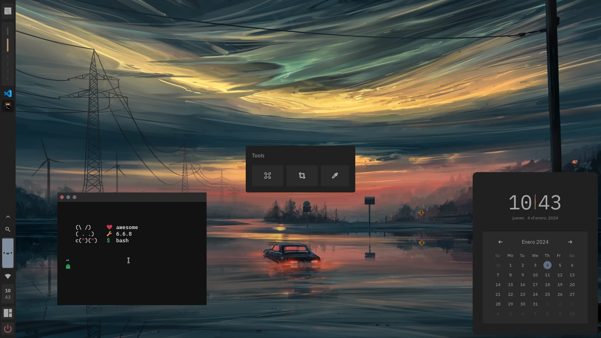

> **Important**
>  My configuration files have been created based on the [Stranger](https://github.com/Gwynsav/gwdawful/) and [fuyu](https://github.com/chadcat7/fuyu)(which is now called crystal) projects. So I ask people to give credit to these amazing people.

<!-- PROFILE PICTURE -->
<p align="center">
  
</p>

<!-- NAME PROYECT -->
<p align="center">
  <b>🍥 Strangyu 🍥</b>
</p>

## 

<div align="center">




</div>


<!--INFO TODO-PANEL-->
<details>
<summary><b> Info todo-panel</b></summary>

<p align="center">
  <b> </b>
</p>

> **Note**
If you want to access the `todo-panel` widget, I suggest you take a look at this particular commit [particular commit](https://github.com/osmarmora05/dotfiles/tree/a30281c92ea9e78e96c609c5c558e3e45e79f367). I decided to remove this widget because I personally don't use it, also it has problems when used with dual monitors, which causes duplication of tasks during its operation, although this problem does not affect the file where the tasks are saved.


</details>

<!-- WARNING BROKEN CODE -->
> **Warning**
It is not uncommon for me to commit broken code. Also I don't guarantee this setup to be stable
or the slightest bit safe for use. You have been warned.

<!-- MASSIVE REFACTOR -->
> **Important**
Massive refactor of how numbers are handled. As things currently are, I made a pretty
big mistake where I performed a **shit ton** of arithmetic/logical operations through out
the config, which in turn causes it to be extremely unstable and prone to crashing. I am
currently working on fixing this, and so the configuration is currently undergoing pretty
fundamental changes. If you were here considering to try it out, I would like to ask you
not to, at least not for the time being.


<!-- INFORMATION -->
## Hello! Thanks for coming! ❤️ 
These are my configuration files for **AwesomeWM** called **Strangyu**, which includes a
user configuration file, a repositionable bar and titles (with animation), a control center,
a dashboard with shortcuts for popular pages, notifications, screenshot tools,
interactive calendar, multiple color schemes.
  
The results shown in the pictures can be achieved
changing just a few variables in the `userconf.lua` file.


## ❄️ Features of config
- **WM:** [AwesomeWM](https://github.com/awesomeWM/awesome) 
- **Operating system:** [Fedora](https://fedoraproject.org/workstation/download/)
- **Terminal:** [Kitty](https://github.com/kovidgoyal/kitty)
- **Shell:** [fish](https://fishshell.com/) 
- **Application Launcher:** [rofi](https://github.com/davatorium/rofi) 
- **File Manager:** [Ranger](https://github.com/ranger/ranger) 

<!-- SETUP -->
## 🔧 Setup

<details>
<summary><b>1. Install Required Dependencies</b></summary>

1. First of all you should install the Awesome-git.


    **Arch users** can use the [Awesome-git AUR package](https://aur.archlinux.org/packages/awesome-git/).
    ```shell
    yay -S awesome-git
    ```

    In the case of **Fedora-based distributions**, it is necessary to install certain libraries before proceeding with the Awesome-git installation(Maybe some bookstore is too much, but hey, you better not miss that on xd).
    ```shell
    sudo dnf install xcb-util-devel xcb-util-keysyms-devel xcb-util-wm-devel 
    startup-notification-devel libxdg-basedir-devel xcb-util-xrm-devel libxkbcommon-x11-devel xcb-cursor-devel 
    make automake gcc gcc-c++ cmake glib2-devel gdk-pixbuf2-devel cairo-devel libX11-devel xcb-util-cursor-devel 
    xcb-util-devel xcb-util-keysyms-devel xcb-util-wm-devel libxkbcommon-devel cairo-devel xcb-util-image-devel 
    libstartup-notification-devel libxdg-basedir-devel xcb-util-xrm-devel libxcb-devel lua-devel cmake 
    startup-notification-devel libxkbcommon-devel libxkbcommon-x11-devel libxdg-basedir-devel xcb-util-xrm-devel
    ```

    Once we have completed the prerequisites, we proceed to follow the Awesome-git build instructions found [here](https://github.com/awesomeWM/awesome/#building-and-installation).

2. Installation of dependencies
   
    **Mandatory**
    - [Awesome-git](https://github.com/awesomeWM/awesome) (If you have reached this point you should already have it installed (๑ᵔ⤙ᵔ๑))
    - [mpd](https://github.com/MusicPlayerDaemon/MPD), 
    [mpDris2](https://github.com/eonpatapon/mpDris2) and 
    [playerctl](https://github.com/altdesktop/playerctl) (music player and actions)
    - [Network Manager](https://github.com/NetworkManager/NetworkManager) (network signals)
    - [Pipewire](https://github.com/PipeWire/pipewire) and
    [Wireplumber](https://github.com/PipeWire/wireplumber) (audio signals)
    - [maim](https://github.com/naelstrof/maim),
    [slop](https://github.com/naelstrof/slop),
    [xclip](https://github.com/astrand/xclip) (screenshots)
    - [Papirus](https://github.com/PapirusDevelopmentTeam/papirus-icon-theme) (icon pack)
    - [IBM Plex Sans](https://github.com/IBM/plex/tree/master/IBM-Plex-Sans/fonts/complete/ttf),
    [Material Icons](https://github.com/google/material-design-icons) and [CaskaydiaCove Nerd Font](https://www.nerdfonts.com/font-downloads) or (you can find the required fonts inside the `misc/fonts` folder of this repository)

    **Optional (toggleable)**
    - [brightnessctl](https://github.com/Hummer12007/brightnessctl) (brightness signals)
    - [bluez](https://github.com/bluez/bluez) (bluetooth signals)
    - [upower](https://github.com/freedesktop/upower) (battery signals)
    <p align="center">
      <b> </b>
    </p>
  
    <details>
    <summary><b> In fedora (Fedora-based distributions)</b></summary>

    ```shell
    sudo dnf install mpd playerctl NetworkManager pipewire wireplumber maim slop xclip brightnessctl bluez upower 
    ```
    - mpDris2 [here](https://koji.fedoraproject.org/koji/buildinfo?buildID=2121825)
    </details>

    <details>
    <summary><b> In Arch</b></summary>

    ```shell
    sudo yay -s mpd playerctl NetworkManager pipewire wireplumber main slop xclip brightnessctl bluez upower mpDris2
    ```

    </details>

   <details>
   <summary><b>Optional - if you want to install the programs I use (in fedora)</b></summary>
    

    ```shell
    sudo dnf install brave-browser rofi kitty htop ranger fish
    ```

    </details>

</details>


<details>

<!-- INSTALL STRANGYU -->
<summary><b>2. Install Strangyu</b></summary>


1. Clone this repository

    ```shell
    git clone https://github.com/osmarmora05/dotfiles.git
      ```

2. Install my AwesomeWM configuration files

    > **Note**
    Before proceeding with the installation, it is recommended that you have the `kitty` terminal installed. If you already have a preferred terminal, you can modify the terminal variable inside the `userconf.lua` file.

    If you want just my AwesomeWM configuration

    ```shell
    cd dotfiles
    cp -r config/awesome/* ~/.config/
    ```
    
    Or if you want all the configuration

    ```shell
    cd dotfiles
    cp -r config/* ~/.config/
    ```
    **Optional** - Now if you want to get the source from the repository

    ```shell
    cd dotfiles
    cp -r misc/fonts/* /usr/share/fonts/
    ```

    Congratulations, at this point you have installed Strangyu! 🎉

    Log out from your current desktop session and log in into AwesomeWM
    
</details>

> **Note**
If you find any spelling or installation errors, let me know.

<!-- KEYBINDS -->
## ⌨️ Usage
Keybinds
<details>

| Keybind                | Description                                                |
| ---------------------- | ---------------------------------------------------------- |
| AwesomeWM              | -                                                          |
| `mod + Control + r`    | Reload AwesomeWM.                                          |
| `mod + w`              | Opens the AwesomeWM menu.                                  |
| `mod + N`              | Switch to Nth tag.                                         |
| `mod + Control + N`    | Show Nth tag on current tag.                               |
| `mod + Shift + N`      | Send focused client to Nth tag.                            |
| `mod + Control + Shift + N` | Show focused client on Nth tag.                       |
| Applications           | -                                                          |
| `mod + Return`         | Opens a terminal.                                          |
| `mod + Shift + Return` | Opens a text editor.                                       |
| `mod + e`              | Opens a TUI file manager.                                  |
| `mod + Shift + e`      | Opens a GUI file manager.                                  |
| `mod + Escape`         | Opens a task manager/top application.                      |
| `ctrl + space`              | Opens an application launcher.                        |
| Window Management      | -                                                          |
| `mod + q`              | Close focused client.                                      |
| `mod + Mouse1`         | Move client by dragging mouse.                             |
| `mod + Mouse3`         | Resize client by dragging mouse.                           |
| `mod + j`              | Focus next client by index.                                |
| `mod + k`              | Focus previous client by index.                            |
| `mod + Shift + j`      | Switch client with next by index.                          |
| `mod + Shift + k`      | Switch client with previous by index.                      |
| `mod + period`         | Focus next screen by index.                                |
| `mod + comma`          | Focus previous screen by index.                            |
| `mod + m`              | Maximize focused client.                                   |
| `mod + f`              | Fullscreen focused client.                                 |
| `mod + s`              | Float focused client.                                      |
| `mod + Shift + s`      | Make focused client sticky.                                |
| `mod + Tab`            | Switch focused slave client with master.                   |
| Layout Management      | -                                                          |
| `mod + l`              | Grow master client.                                        |
| `mod + h`              | Shrink master client.                                      |
| `mod + equal`          | Increase amount of master clients.                         |
| `mod + minus`          | Decrease amount of master clients.                         |
| `mod + Shift + l`      | Grow tiled client.                                         |
| `mod + Shift + h`      | Shrink tiled client.                                       |
| `mod + Shift + equal`  | Increase amount of slave columns.                          |
| `mod + Shift + minus`  | Decrease amount of slave columns.                          |
| `mod + space`          | Cycle to next layout.                                      |
| `mod + Shift + space`  | Cycle to previous layout.                                  |
| Media Management       | -                                                          |
| `XF86AudioRaiseVolume` | Increase system audio volume.                              |
| `XF86AudioLowerVolume` | Decrease system audio volume.                              |
| `XF86AudioMute`        | Mute system audio.                                         |
| `XF86AudioPlay`        | Play/pause media playback.                                 |
| `XF86AudioNext`        | Skip to next song/video.                                   |
| `XF86AudioPrev`        | Rewind to previous song/video.                             |
| `XF86MonBrightnessUp`  | Increase screen backlight brightness.                      |
| `XF86MonBrightnessDown`| Decrease screen backlight brightness.                      |
| `mod + u`              | Cycle keyboard layouts.                                    |
| `Print`                | Take cursor selection screenshot.                          |
| `mod + Print`          | Take fullscreen screenshot.                                |
| `mod + c`              | Take selection screenshot.                                 |
| UI                     | -                                                          |
| `mod + b`              | Toggle bar visibility.                                     |
| `mod + d`              | Toggle dashboard visibility.                               |
| `mod + t`              | Toggle themer-panel visibility.                              |


</details>

<!-- CONFIGURATION -->
## ⚙️ Configuration
Simple Configuration

You can edit some basic stuff by using the included variables inside of `userconf.lua`. This configuration includes, border size, gaps, titles, bar positions, and much more, as well as toggling features.


<details>

> **Warning**
IT IS NOT RECOMMENDED TO MOVE THE VARIABLE `user.clr_palette` FROM THE CURRENT LINE(111), BECAUSE IT IS LINKED TO THE THEMER WIDGET. IF YOU MOVE IT FROM THE CURRENT LINE, YOU MUST MODIFY THE SECOND ARGUMENT OF THE `setTheme` FUNCTION IN THE `awesome/ui/themer-panel/modules/themer.lua` FILE

```lua
setTheme('user.clr_palette = "' .. currTheme:gsub('"', '\\"') .. '"',line number,os.getenv("HOME") .. "/.config/awesome/ userconf.lua") --Change theme
```

  
| Variable       | Type      | Description                                                                        |
| -------------- | --------- | ---------------------------------------------------------------------------------- |
| Applications   | -         | -                                                                                  |
| `terminal`     | `string`  | Terminal emulator to use. **Must be set**.                                         |
| `editor`       | `string`  | Text editor to use. **Must be set**.                                               |
| `browser`      | `string`  | Internet browser to use. **Must be set**.                                          |
| `top`          | `string`  | top application (like htop) to use. **Must be set**.                               |
| `files_cli`    | `string`  | CLI file explorer to use. **Must be set**.                                         |
| `files_gui`    | `string`  | GUI file explorer to use. **Must be set**.                                         |
| Settings       | -         | -                                                                                  |
| `modkey`       | `string`  | Mod1 is Alt, Mod4 is Super. Defaults to **"Mod4"**.                                |
| `caps_super`   | `boolean` | Makes CapsLock an additional Super key. Defaults to **false**.                     |
| `hover_focus`  | `boolean` | Should windows be focused on hover. Defaults to **false**.                         |
| `kb_layout1`   | `string`  | Keyboard layout to use. Entirely **optional**.                                     |
| `kb_layout2`   | `string`  | Alternate keyboard layout. Also entirely **optional**.                             |
| Features       | -         | -                                                                                  |
| `battery`      | `boolean` | Enable/disable battery metrics. Defaults to **false**.                             |
| `battery_name` | `boolean` | Specify battery name from Upower's interface. Defaults to **"battery_BAT0"**.      |
| `brightness`   | `boolean` | Enable/disable brightness metrics. Defaults to **false**.                          |
| `brightness_name` | `boolean` | Specify video adapter name from '/sys/class/backlight'. Defaults to **"intel_backlight"** |
| `bluetoothctl` | `boolean` | Enable/disable bluetooth metrics. Defaults to **false**.                           |
| UI             | -         | -                                                                                  |
| `resolution`   | `number`  | Your vertical resolution, eg 1080p. Defaults to **1080**.                          |
| `aspect_ratio` | `number`  | Your aspect ratio, eg 16/9 or 4/3. Defaults to **16/9**.                           |
| `dpi`          | `number`  | Your dpi. Defaults to **auto**. Dots built on 96, for reference.                   |
| `inner_gaps`   | `number`  | Regular gap size (screen%). Defaults to **0.4**.                                   |
| `outer_gaps`   | `number`  | Screen padding size (screen%). Defaults to **3 * inner_gaps**.                     |
| `border_rad`   | `number`  | Border rounding (screen%), 0 to disable. Defaults to **0.8**.                      |
| `bar_enabled`  | `boolean` | Change default bar state. Defaults to **true**.                                    |
| `bar_pos`      | `string`  | May be: "left", "top", "right", "bottom". Defaults to **"left"**.                  |
| `title_enable` | `boolean` | Enable/disable client titlebars. Defaults to **true**.                             |
| `title_invert` | `boolean` | Enable/disable position invert buttons in title. Defaults to **true**.                             |
| `bar_gaps`     | `boolean` | Enable/disable bar gaps. Defaults to **true**.                                     |
| Theming        | -         | -                                                      |
| `clr_palette`  | `string`  | "everblush", "everforest", "tokyonight", "gruvbox_light", "solarized", "fullerene", "oxocarbon","catpuccin","fullerene","mar","plata","nord","grubvox_dark","dracula". Does **NOT** have a default. |
| `icon_pack`    | `string`  | GTK icon pack name. Defaults to **"Papirus"**.                                     |
| `ui_font`      | `string`  | Name of main UI font. Does **NOT** take size. Defaults to **"IBM Plex Sans"**.     |
| `ic_font`      | `string`  | Name of text icon font. Does **NOT** take size. Defaults to **"Material Icons"**.  |
| `mn_font`      | `string`  | Name of monospace font. Does **NOT** take size. Defaults to **"CaskaydiaCove Nerd Font"**.   |
| `user_avatar`  | `string`  | Path to user profile picture. Defaults to **$AWM/themes/assets/user.png"**.        |
| `user_wall`    | `string`  | Path to user wallpaper. Defaults to **colorscheme default**.                       |
| `player_bg`    | `string`  | Path to music player background image. Defaults to **colorscheme default**.        |
| `awm_icon`     | `string`  | "arch", "debian", "fedora", "nix", "ubuntu", "void" or path. Defaults to **AWM icon**. |
| Misc           | -         | -                                                                                  |
| `scrnshot_dir` | `string`  | Directory to save screenshots to. Defaults to **$HOME/Pictures/**.                 |
| `scratch_wide` | `number`  | Scratchpad terminal width (screen%). Defaults to **40**.                           |
| `scratch_high` | `number`  | Scratchpad terminal height (screen%). Defaults to **66**.                          |


<details>
<summary><b> Optional</b></summary>

<p align="center">
  <b> </b>
</p>

> **Warning**
If you are a user not familiar with programming, and mainly in lua, I recommend that you skip this part.

If you want to modify the todo-panel shortcuts, you can go to the `ui/themer-panel/modules/quicklinks.lua` file. In this file, you'll find this code snippet that you can edit to customize the shortcuts.

```lua
create_button("󰑍", 'https://www.reddit.com/', beautiful.red,beautiful.gry),
create_button("󰖣", 'https://web.whatsapp.com/', beautiful.grn,beautiful.gry),
create_button("󰉎", 'https://drive.google.com/drive/', beautiful.cya,beautiful.gry),
create_button("󰊤", 'https://github.com/osmarmora05', beautiful.wht,beautiful.gry),
create_button("󰊫", "https://mail.google.com/", beautiful.blu,beautiful.gry),
```

Inside the `create_button` function, the first parameter is the icon of the shortcut, which you can get [here](https://www.nerdfonts.com/cheat-sheet) . The second parameter is the URL that the shortcut should point to. **It is recommended not to modify the rest of the code and not to add or remove shortcuts.**


If you want to change the themer-panel messages, you can go to the `ui/themer-panel/modules/quote.lua` file. In this file, you'll find a code snippet that you can edit to customize the messages.

```lua
local quotes = {
  {
    quote = "He that can have patience can have what he will",
    author = "Benjamin Franklin"
  },
  {
    quote = "The question is not who is going to leave me; is who is going to stop me.",
    author = "Ayn Rand"
  },
  {
    quote = "Life would be so much easier if could just look at the source code",
    author = "Dave Olsen"
  },
  {
    quote = "Work hard in silence and let your success make all the noise.",
    author = "Frank Ocean"
  }
}

```
The code defines a table called `quotes` that contains a list of `quotes`. Each quote is represented by a table element, which is itself a table with two fields: `quote` (the message itself) and `author` (the author of the message).

You can modify the content of the `quotes` table to change the messages. In the `quote` field, you can write the message you want to display in the todo-panel. It is recommended that the message does **not exceed 85 characters** to ensure that it is displayed correctly on the panel. In the `author` field, you can write the author of the message. It is recommended that the author have **no more than 15 characters**.

It is important to note that **it is recommended not to modify the rest of the code and not to add or remove elements from the `quotes` table to avoid possible errors**.

</details>
  
</details>

<!-- MODULES -->
## 🧰 Modules
AwesomeWM Modules:

<details>

<p align="center">
  <b> </b>
</p>

- [bling](https://github.com/blingcorp/bling) 
  - Adds new layouts, modules, and widgets that try to focus on window management primarily
- [color](https://github.com/andOrlando/color)
  - Clean and efficient api for color conversion in lua
- [UPower](https://github.com/Aire-One/awesome-battery_widget)
  - A UPowerGlib based battery widget for the Awesome WM
- [rubato](https://github.com/andOrlando/rubato)
  - Smooth animations with a slope curve for AwesomeWM
  
</details>

<!-- TODO -->
## ☑️ Todo
- [ ] Clean code
- [ ] Refactor code
- [x] Using Material Icons font in todo-panel icon
- [x] Change the color of the terminal and the editor depending on the theme set in `userconf.lua`
- [ ] Implement a minimalist task widget

<!-- CREDITS -->
## 💝 Credits

Strangyu is the result of the merger of gw's brilliant projects 'Stranger' and chadcat7's 'Fuyu'(which is now called crystal). So without them this would not have been possible.  ૮꒰ ˶• ༝ •˶꒱ა ♡

- [gw](https://github.com/Gwynsav)
- [chadcat7](https://github.com/chadcat7/fuyu)

<!-- REFERENCES -->
## 🔥 References
These people's dotfiles (and in some cases they themselves) have massively
helped me create this configuration.

[Blyaticon's cropping helper](https://git.gemia.net/paul.s/homedots). 

[Alpha.'s NixOS Awesome setup](https://github.com/AlphaTechnolog/nixdots). 

[Stardust-kyun's dotfiles](https://github.com/Stardust-kyun/dotfiles). 

[Aproxia's dotfiles](https://github.com/Aproxia-dev/.dotfiles). 

Also got a few ideas from [elenapan's dotfiles](https://github.com/elenapan/dotfiles) 
and [rxyhn's Yoru](https://github.com/rxyhn/yoru).
