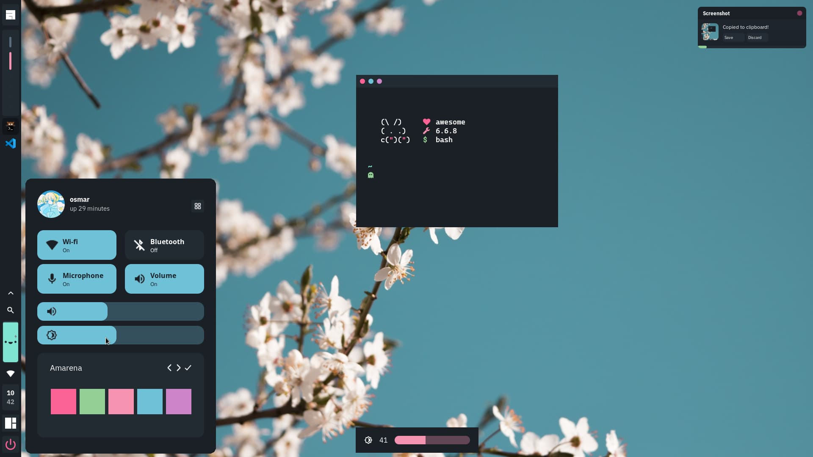
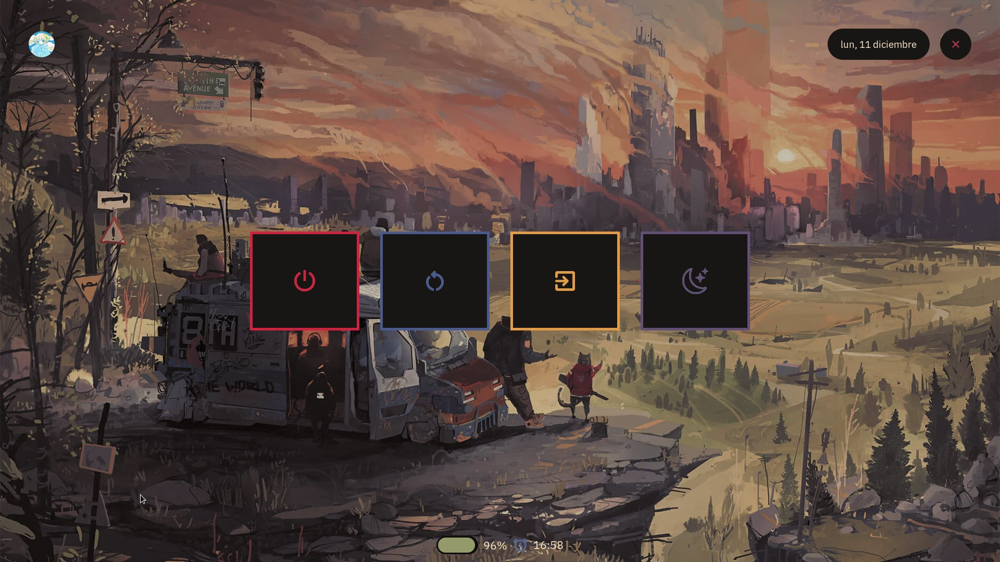

<!-- PROFILE PICTURE -->
<p align="center">
  
</p>

<!-- NAME PROYECT -->
<p align="center">
  <b>~ Sway configuration files ~</b>
</p>

<!-- BUTTONS -->
<p align="center">
<a href="#features-of-config"></a>
<a href="#setup"></a>
<a href="#configuration"></a>
<a href="#usage"></a>
</p>

<!-- SHOWCASE -->
## 
<div align="center">




</div>

<!-- WARNING BROKEN CODE -->
> **Warning**
It is not uncommon for me to commit broken code. Also I don't guarantee this setup to be stable
or the slightest bit safe for use. You have been warned.

<!-- WELCOME -->
## Hello! Thanks for coming! ❤️ 
These are my configuration files for **Sway** which includes a bar with computer information, an exit screen and a minimalist lock screen

<!-- INFORMATION -->
## Features of config
- **WM:** [Sway](https://swaywm.org/)
- **Operating system:** [Fedora](https://fedoraproject.org/workstation/download/)
- **Terminal:** [Kitty](https://github.com/kovidgoyal/kitty)
- **Shell:** [fish](https://github.com/fish-shell/fish-shell)
- **Prompt:** [Starship](https://starship.rs/)
- **File Manager CLI:** [Ranger](https://github.com/ranger/ranger) 
- **File Manager UI:** nautilus

<!-- SETUP -->
## Setup
<b>1. Install Required Dependencies</b>

- [Sway](https://swaywm.org/) (Windows manager)
- [Waybar](https://github.com/Alexays/Waybar) (bar)
- [wlogout](https://github.com/ArtsyMacaw/wlogout) (exit screen)
- [swaylock](https://github.com/swaywm/swaylock), [swaylock-effects](https://github.com/mortie/swaylock-effects) (lock screen)
- [Wireplumber](https://github.com/PipeWire/wireplumber) (audio control)
- [brightnessctl](https://github.com/Hummer12007/brightnessctl) (brightness control)
- [rofi](https://github.com/adi1090x/rofi) (launcher)
- [hyprpicker](https://github.com/hyprwm/hyprpicker) (color picker)
- [wayshot](https://github.com/reinefjord/wayshot), [grim](https://github.com/emersion/grim), [slurp](https://github.com/emersion/slurp), [jq](https://github.com/jqlang/jq) (screenshot)
- [wl-clipboard](https://github.com/bugaevc/wl-clipboard) (clipboard)
- [notify-send](https://github.com/GNOME/libnotify) (notifications)
- [IBM-Plex-Mono](https://github.com/IBM/plex/tree/master/IBM-Plex-Mono/fonts/complete/ttf), [CaskaydiaCove Nerd Font](https://www.nerdfonts.com/font-downloads) (fonts) (you can find the required fonts inside the `misc/fonts` folder of this repository)

> **Important**
> I suggest you compile **hyprpicker**. Although I know that the binary is in my configurations, I strongly recommend that you compile it to avoid possible problems.

<details>
<summary><b> In fedora (Fedora-based distributions)</b></summary>

```shell
sudo dnf install waybar sway wlogout swaylock wireplumber brightnessctl rofi grim slurp jq wl-clipboard notify-send 
```

> To install `swaylock-effects` you will need the following dependencies and follow the build instructions [here](https://github.com/mortie/swaylock-effects):

```shell
sudo dnf install ninja-build meson wayland-protocols-devel wayland-devel
```

> To install `hyprpicker` you will need the following dependencies and follow the build instructions [here](https://github.com/hyprwm/hyprpicker):

```shell
sudo dnf install ninja-build meson mesa-libGLES-devel pango pango-devel
```

</details>

<b>2. Install my configuration files</b>

1. Clone this repository

```shell
git clone --single-branch --branch sway https://github.com/osmarmora05/dotfiles.git
```

2. Install my Sway configuration files

 ```shell
cd dotfiles
cp -r config/* ~/.config/
```
 **Optional** - Now if you want to get the fonts from the repository

 ```shell
cd dotfiles
cp -r misc/fonts/* /usr/share/fonts/
```

<!-- CONFIGURATION -->
## Configuration

~ `sway/config`: add terminal, gap size, file explorer, wallpaper path, screenshot directory path

~ `waybar/config`: So that the top bar correctly shows you the brightness percentage and allows you to control it. You must specify the brightness of the device, in my case it is AMD

```json
"backlight": {
          "device": "amdgpu_bl2", // line to modify
          "format": "{percent}% {icon}",
          "format-icons": [
               "󰃞",
               "󰃟",
               "󰃠"
          ]
     },
```

The device name resides in the following path: `/sys/class/backlight/`

<!-- KEYBINDS -->
## Usage
<details>
<summary><b>Main keybinds</b></summary>

| Keybind                | Description                                                |
| ---------------------- | ---------------------------------------------------------- |
| Sway                   | -                                                          |
| `mod + Shift + q`      | Exit Sway.                                                 |
| `mod + Control + r`    | Reload config.                                             |
| Applications           | -                                                          |
| `mod + Return`         | Opens a terminal.                                          |
| `mod + Shift + e`      | Opens a GUI file manager.                                  |
| Window Management      | -                                                          |
| `mod + q`              | Close focused client.                                      |
| `Control + mod + Space` | toggle floating.                                          |
| `mod + j`              | Focus next by index.                                       |
| `mod + k`              | Focus previous by index.                                   |
| `mod + m`              | (un)maximize.                                              |
| `mod + n`              | Minimze.                                                   |
| Media Management       | -                                                          |
| `XF86AudioRaiseVolume` | Increase system audio volume.                              |
| `XF86AudioLowerVolume` | Decrease system audio volume.                              |
| `XF86MonBrightnessUp`  | Increase screen backlight brightness.                      |
| `XF86MonBrightnessDown`| Decrease screen backlight brightness.                      |
| `Print`                | Take cursor selection screenshot.                          |
| `mod + Print`          | Take fullscreen screenshot.                                |
| `mod + o`              | Color picker.                                              |

To learn more keybinds [here](https://wiki.garudalinux.org/en/sway-cheatsheet)

</details>

<!-- CREDITS -->
## Credits

[yakei](ttps://gitlab.com/yakei/Desktop) Reference to get started with sway and its waybar configuration is very easy to understand. Very good

[Stephan Raabe](https://gitlab.com/stephan-raabe/dotfiles/-/tree/main?ref_type=heads) Configuration for swaylock, wlogout. And also, their YouTube channel is very good and explains things very clearly.